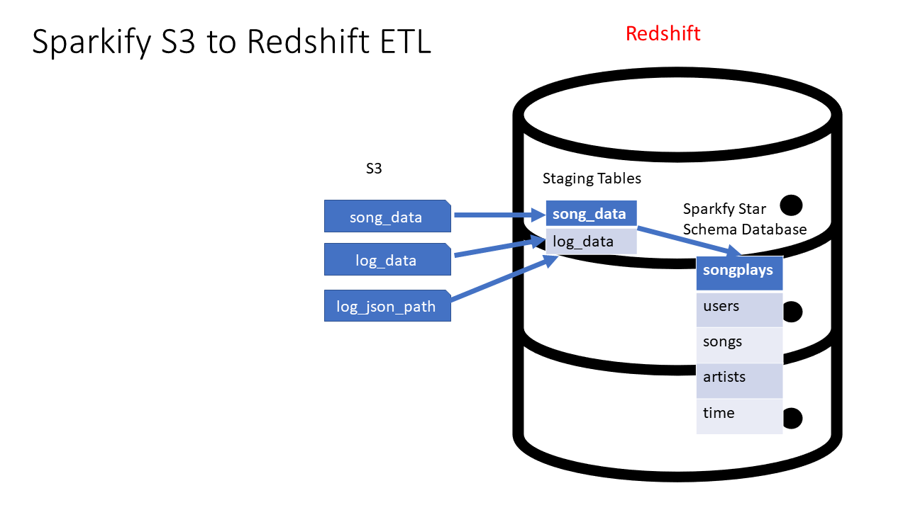

# Project: Data Warehouse

## Introduction
The code in this repo performs extract, load, and transform (ELT) operations in Redshift with Sparkify's data to assist the music streaming startup with their business intelligence reports.

The source data is stored in Amazon S3 buckets. The ELT pipeline consists of Python scripts that use the psycopg2 library to execute Redshift copy commands of the source data (user events and the song library) to staging tables (staging_events and staging_songs, respectively). Next, a star schema is implemented by creating a facts table (songplays) that contains the user play event timestamps the sort keys for four dimension tables (users, songs, artists, time).

Here are brief summaries of the data stored in the dimensions tables:
* users - Sparkify's users' full names, their genders, and their membership levels
* songs - songs' titles, artist id's, year released, and duration
* artists - artists' names, locations, and coordinates
* time - timestamps from users' listening  events with granular details including the hour, day, week, month, and year  



## Prerequisites
1. Create an IAM role with approprirate permissions for Redshift to assume
1. Deploy a Redshift Cluster or Redshift Serverless with the IAM role attached
1. Configure a security group to allow your IP address to access
1. Create a configuration file called **dwh.cfg** in the root of this folder that contains the following information:
```conf
[CLUSTER]
HOST=# Your Redshift Cluster/Serverless Endpoint
DB_NAME=# Your Redshift Database
DB_USER=# Your Redshift Username
DB_PASSWORD=# Your Redshift Password
DB_PORT=# Your Redshift Database Port to Connect to. Remember to configure your security group!

[IAM_ROLE]
ARN=# The IAM Role you assigned to Redshift.

[S3]
LOG_DATA='s3://udacity-dend/log_data'
LOG_JSONPATH='s3://udacity-dend/log_json_path.json'
SONG_DATA='s3://udacity-dend/song_data'
```

## Sparkify Questions to Answer
1. Which songs from each decade were most popular with users to curate 80's, 90's, etc. playlists?
1. What were the most popular songs between the period of U.S. Thanksiving and New Years to consider curating a Christmas playlist to countries that observe that holiday?
1. Which songs were most popular with women during the month of March to curate a Women's History Month playlist?
1. What songs were popular on Wednesdays to make a Hump Day playlist?

## Document Process
Do the following steps in your README.md file. Here's a guide on Markdown Syntax.

Discuss the purpose of this database in context of the startup, Sparkify, and their analytical goals.
State and justify your database schema design and ETL pipeline.

The README file includes a summary of the project, how to run the Python scripts, and an explanation of the files in the repository. Comments are used effectively and each function has a docstring.

[Optional] Provide example queries and results for song play analysis. We do not provide you any of these. You, as part of the Data Engineering team were tasked to build this ETL. Thorough study has gone into the star schema, tables, and columns required. The ETL will be effective and provide the data and in the format required. However, as an exercise, it seems almost silly to NOT show SOME examples of potential queries that could be ran by the users. PLEASE use your imagination here. For example, what is the most played song? When is the highest usage time of day by hour for songs? It would not take much to imagine what types of questions that corporate users of the system would find interesting. Including those queries and the answers makes your project far more compelling when using it as an example of your work to people / companies that would be interested. You could simply have a section of sql_queries.py that is executed after the load is done that prints a question and then the answer.


## Build the Environment

Executing the following command that accomplishes the following:
1. Run the **create_tables.py** script that drops any previous iterations of the staging and destination tables, and it recreates them.
1. Run the **etl.py** script that populates the staging tables first and then uses these tables to build the 
### Run the Code

```bash
$ python create_tables.py && python etl.py
```

## Environment Cleanup

Make sure to delete your cluster if you are completely done with the evaluation. If you will retain the cluster execute the following command

```bash
$ python cleanup.py
```